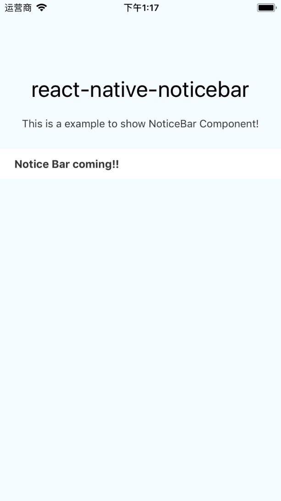

# react-native-noticebar

NoticeBar component for React Native, works at iOS and Android.



# Install

```
npm install react-native-noticebar --save
```

# Usage

```
import NoticeBar from 'react-native-noticebar'

class Demo extends React.Component {
  constructor(props) {
    super(props)
    this.state = {
      noticeList: [
        {
          id: 1,
          title: 'This is Notice Bar!'
        },
        {
          id: 2,
          title: 'Notice Bar coming!!'
        }
      ]
    }
  }

  // noticebar change event
  handleChange = (index) => {
    console.log(`Current index is ${index}.` )
  }

  // noticebar press event
  handlePress = (item) => {
    console.log(item)
  }

  // render item
  renderBarItem = (item, index) => {
    return (
      <View>
        <Text numberOfLines={1}>{item.title}</Text>
      </View>
    )
  }

  render() {
    return (
      <View>
        <Text>NoticeBar Demo</Text>
        <NoticeBar
          data={ noticeList }
          renderBarItem={ this.renderBarItem }
          scrollHeight={ 40 }
          scrollBarStyle={ styles.barStyle }
          delay={ 3000 }
          duration={ 500 }
          easing='linear'
          onChange={ this.handleChange }
          onPress={ this.handlePress }></NoticeBar>
      </View>
    )
  }
}
```

# Props

<table>
    <tr>
        <th>Prop name</th>
        <th>Description</th>
        <th>Type</th>
        <th>Default</th>
    </tr>
    <tr>
        <td>data</td>
        <td>You know, the data</td>
        <td>PropTypes.string or PropTypes.element</td>
        <td></td>
    </tr>
    <tr>
        <td>scrollHeight</td>
        <td>Height of the single Bar</td>
        <td>PropTypes.number</td>
        <td>36</td>
    </tr>
    <tr>
        <td>renderBarItem</td>
        <td></td>
        <td>PropTypes.func</td>
        <td></td>
    </tr>
    <tr>
        <td>scrollBarStyle</td>
        <td>Bar wrap's style</td>
        <td>PropTypes.object</td>
        <td></td>
    </tr>
    <tr>
        <td>delay</td>
        <td></td>
        <td>PropTypes.number</td>
        <td>3000</td>
    </tr>
    <tr>
        <td>duration</td>
        <td></td>
        <td>PropTypes.number</td>
        <td>500</td>
    </tr>
    <tr>
        <td>easing</td>
        <td></td>
        <td>PropTypes.string, One of the ['step0','step1','linear','ease','quad','cubic','sin','circle','exp',
'bounce']</td>
        <td>linear</td>
    </tr>
    <tr>
        <td>onChange</td>
        <td>Callback when noticebar has changed</td>
        <td>PropTypes.func</td>
        <td></td>
    </tr>
    <tr>
        <td>onPress</td>
        <td>Press function</td>
        <td>PropTypes.func</td>
        <td></td>
    </tr>
</table>
